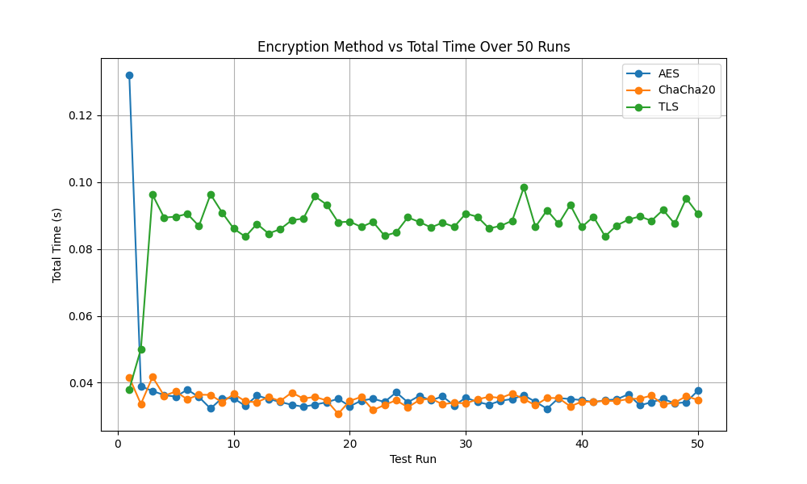

# 🚗 **Lidar Encryption Analysis** 🔒  
**자율주행차 LiDAR 데이터 암호화 성능 분석**  

## **프로젝트 개요**  
이 프로젝트는 자율주행차의 **LiDAR 데이터**를 **AES**, **ChaCha20**, 및 **TLS** 암호화 알고리즘을 사용하여 전송하고 성능을 비교 분석합니다.  
전송 시간, 암호화/복호화 시간, 오버헤드 등을 측정하여 **실시간 데이터 전송**에 최적의 암호화 알고리즘을 도출하는 것이 목표입니다.  

---

## **프로젝트 구조**  
```bash
Lidar_Encryption_Analysis/
│
├── encryption/                     # 암호화 알고리즘 모듈
│   ├── aes_encryption.py           # AES 암호화/복호화 함수
│   ├── chacha20_encryption.py      # ChaCha20 암호화/복호화 함수
│   └── tls_encryption.py           # TLS 암호화/복호화 함수
│
├── cert/                           # TLS를 위한 인증서
│   ├── cert.pem                    # 서버 인증서
│   └── key.pem                     # 서버 개인 키
│
├── data/                           # 데이터 파일
│   └── lidar_data_32ch.json        # 테스트용 LiDAR 데이터
│
├── results/                        # 테스트 결과 및 그래프
│   ├── total_times.csv             # 최종 측정된 성능 데이터
│   └── total_times_plot.png        # 성능 비교 그래프
│
├── main_network_test.py            # 메인 실행 코드
├── requirements.txt                # 필요 라이브러리
└── README.md                       # 프로젝트 설명 파일
```

---

## **실행 환경**  
다음 환경에서 테스트되었습니다:  
- **OS**: Ubuntu 20.04 / Windows 11 WSL2
- **Python**: 3.8 이상  

---

## **설치 및 실행 방법**  

1. **프로젝트 클론**  
   ```bash
   git clone https://github.com/kelvin926/Lidar_Encryption_Analysis.git
   cd Lidar_Encryption_Analysis
   ```

2. **필수 라이브러리 설치**  
   ```bash
   pip install -r requirements.txt
   ```

3. **TLS 인증서 생성 (옵션)**  
   TLS를 직접 설정하려면 인증서를 새로 생성할 수 있습니다:  
   ```bash
   openssl req -x509 -newkey rsa:4096 -keyout cert/key.pem -out cert/cert.pem -days 365 -nodes
   ```

4. **테스트 실행**  
   **테스트 반복 횟수**를 설정하여 실행합니다.  
   ```bash
   python3 main_network_test.py
   # 실행 후 뜨는 화면에서 횟수 입력 (예시: 5)
   ```

5. **결과 확인**  
   - **CSV 파일**: `results/total_times.csv`  
   - **그래프**: `results/total_times_plot.png`  

---

## **결과 예시**  
### **그래프: 암호화 알고리즘별 총 전송 시간**  
  

### **결과 데이터**  
| **Test Run** | **AES**   | **ChaCha20** | **TLS**    |
|--------------|-----------|-------------|------------|
| 1            | 0.132s    | 0.041s      | 0.038s     |
| 2            | 0.038s    | 0.033s      | 0.050s     |
| 3            | 0.037s    | 0.041s      | 0.096s     |
| ...          | ...       | ...         | ...        |

---

## **암호화 알고리즘 비교**  
- **AES**: 하드웨어 가속 시 빠르지만 고정된 환경에 유리합니다.  
- **ChaCha20**: 경량화된 암호화 알고리즘으로 저전력 시스템에 적합합니다.  
- **TLS**: 강력한 보안을 제공하지만 핸드셰이크로 인한 **초기 오버헤드**가 발생합니다.  

---

## **결론**  
**실시간 LiDAR 데이터 전송**에는 **ChaCha20**이 가장 적합합니다.  
- 빠른 전송 속도  
- 일관된 성능  
- 저전력 및 경량 환경에 최적화  

---

## **기여 방법**  
이 프로젝트에 기여하고 싶으시다면 **Pull Request**를 보내주세요!  
- **버그 리포트**  
- **기능 추가**  
- **성능 개선**  

---

## **문의**  
프로젝트에 대한 질문이나 개선 사항은 **이슈**에 등록하거나 이메일로 연락주세요.  
- **이메일**: kelvin926@korea.ac.kr

---

### **참고사항**  
이 프로젝트는 24-2 자율주행안전및보안 기말고사 발표 목적으로 제작되었습니다.